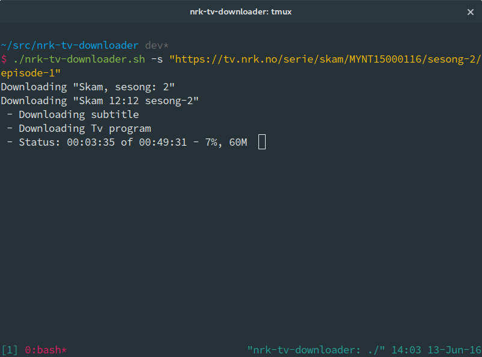

# nrk-tv-downloader
> Shell-script for downloading content from nrk-tv and nrk-radio

## About

This is just another simple shell-script that downloads programs from nrk-tv. It also supports nrk-radio.

This script has nothing to do with NRK!

## Install
    $ git clone https://github.com/odinuge/nrk-tv-downloader/ --recursive

## Usage

    chmod +x nrk-tv-downloader.sh
    [...]
    Usage: ./nrk-tv-downloader.sh <OPTION>... [PROGRAM_URL(s)]...

    Options:
         -a download all episodes, in all seasons.
         -s download all episodes in season
         -n skip files that exists
         -d dry run - list what is possible to download
         -h print this

    For updates see <https://github.com/odinuge/nrk-tv-downloader>

    Example:
    $ ./nrk-tv-downloader.sh -a http://tv.nrk.no/serie/tore-paa-sporet/dmpf71005710/17-02-2013

## Requirements
This script requires bash, rev, cut, grep, sed, awk, printf, curl and ffmpeg/avconv.

## License
MIT © [Odin Ugedal](https://ugedal.com)
